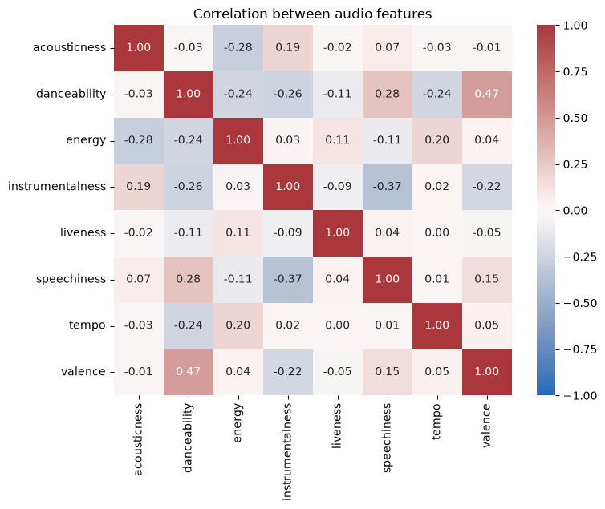

# Classifying song genres from audio features

Classifies tracks as hip-hop or rock from eight Echo Nest audio features, using PCA, a decision tree and logistic regression, and compares two ways of handling class imbalance.



## Data

`datasets/fma-rock-vs-hiphop.csv` (track metadata and genre) and `datasets/echonest-metrics.json` (audio features). The data comes from the DataCamp project of the same name.

## Key results

- Rock outnumbers hip-hop four to one, so plain accuracy is misleading: the unweighted logistic regression scores 88% but finds only half of the hip-hop tracks.
- With class weights, hip-hop recall rises from 0.49 to 0.79 and balanced accuracy from 0.74 to 0.82.
- Class weights do as well as undersampling without discarding data.

## Running the notebook

```bash
pip install -r requirements.txt
jupyter notebook notebook.ipynb
```
